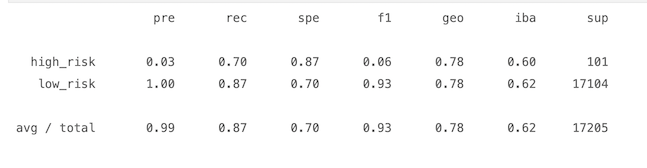

# **Credit_Risk_Analysis**

**Supervised Machine Learning**

## **Analysis Overview**

Perform credit risk analysis using imbalanced-learn and scikit-learn libraries to build and evaluate Supervised Machine learning Models using resampling techniques where models with unbalanced classes are trained and evaluated, in order to write a recommendation on whether any of them should be used to predict credit risk.

Using the credit card dataset from LendingClub, a peer-to-peer lending services company, to oversample the data using the following machine learning models and their algorithms:
- Oversampling Model
    - RandomOverSampler Algorithm
    - SMOTE Algorithm
- Undersampling Model:
    - ClusterCentroids Algorithm
- Combination Over- and Under Sampling Model
    - SMOTEENN Algorithm
- Reducing Bias Models:
    - BalancedRandomForestClassifier
    - EasyEnsembleClassifier

## **Results**

### **Classification Reports**

The results are presented between 0 and 1, where 0 means that the model does not perform well on the metric being measured, while 1 means that it does perform well.

#### **Random Oversampling**

#### **SMOTE Oversampling**

#### **Cluster Centroids Undersampling**

#### **SMOTEENN Combination Under and Over Sampling**

#### **Balanced Random Forest Classifier**

#### **Easy Ensemble AdaBoost Classifier**

- **Precision:**
    - The precision of the bad loan applications (high_risk) is very close to 0% for all six algorithms, indicating that none of the models predict well the number of true positives. On the other hand, all the models are 1 or 100% for the low_risk class which means they are great at predicting good loan applications.

- **Recall/Sensitivity:**
    - The Easy Ensemble AdaBoost Classifier showed good recall results, where bad loan applications had 92% and good loans had 94%.
    - The balanced Random Forest Classifier had a decent recall of 87% on the good loans.
    - All the other algorithms didn't perform ideally on the recall results.

- **Specificity:**

    - Balanced Random Forest Classifier had the specificity of 87% on the high_risk, which means it is good at avoiding false positive bad loans.
    - Easy Ensemble AdaBoost Classifier had the specificity of 94% on the high_risk and 92% on the low_risk, which means it is great at avoiding false positives for both.
    - All the other algorithms didn't present good specificity results.

- **f1 metric:**
    - high_risk:
        - None of the models had good results on the f1 metric applied to the bad loans.
    - low_risk:
        - Besides the under sampling ClusterCentroids, all the other algorithms showed good f1 results, the highest two being the Balanced Random Forest Classifier with 93% and the Easy Ensemble AdaBoost Classifier with 97%.

#### **Model Accuracy Results**

- The model with the best accuracy was the Easy Ensemble AdaBoost Classifier with 93%.
- None of the other models had optimal accuracy results.

## **Summary**

None of the models had optimal overall combined metrics results to predict, avoid, and detect high risk loans, even though the Easy Ensemble AdaBoost Classifier had great results on the recall, specificity, and accuracy its close to 0 precision result impacted negatively its f1 metric, which is the harmonic balance between precision and sensitivity.
On the other hand, if looking at the overall performance of the low risk loan applications, the Easy Ensemble AdaBoost Classifier performed really well on all metrics measured.

In summary, I would not recommend any of these models to be used by a company that is trying to avoid having high risk loan applications, since even the one that performs a little better, Easy Ensemble AdaBoost Classifier, still has its f1 metric really low.

