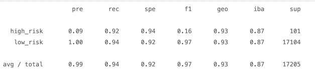

# Credit_Risk_Analysis

Supervised Machine Learning

## Analysis Overview

## Results

### Random Oversampling

### SMOTE Oversampling

### Cluster Centroids Undersampling

### SMOTEENN Combination Under and Over Sampling

### Balanced Random Forest Classifier - Ensemble Learner

### Easy Ensemble AdaBoost Classifier

### 2nd Test on Balanced Random Forest Classifier - Ensemble Learner

## Summary

### Model Accuracy

-------------------------------------------------------------------------------------------------------------------------------
For this deliverable, you’ll write a brief summary and analysis of the performance of all the machine learning models used in this Challenge.

The report should contain the following:

Overview of the analysis: Explain the purpose of this analysis.

Results: Using bulleted lists, describe the balanced accuracy scores and the precision and recall scores of all six machine learning models. Use screenshots of your outputs to support your results.

Summary: Summarize the results of the machine learning models, and include a recommendation on the model to use, if any. If you do not recommend any of the models, justify your reasoning.

----------------------
Analysis (24 points)
The written analysis has the following:

Overview of the loan prediction risk analysis:

The purpose of this analysis is well defined (4 pt)

Results:

There is a bulleted list that describes the balanced accuracy score and the precision and recall scores of all six machine learning models (15 pt)

Summary:

There is a summary of the results (2 pt)
There is a recommendation on which model to use, or there is no recommendation with a justification (3 pt)